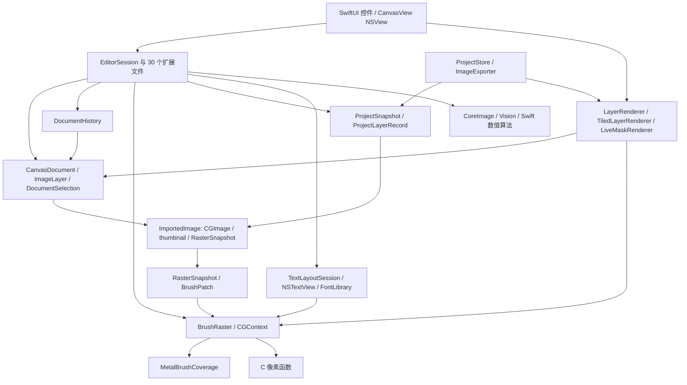

# Windows 移植：真实代码耦合与计划复评

日期：2026-09-20。审计提交：`d562565e5f1c53a7ece4dd2d1f6c0ef3547a3c28`。本次核对时 `main` 与 `windows-part` 指向同一提交；不包含原工作区 `.gitignore` 修改。本报告替代“目录分层即平台分层”的假设，不替代此前开源库调研。

## 1. 结论与实施判断

Windows 版可以继续推进，但应按**复用少量 C 算法、迁移业务规则、重新实现桌面编辑器运行时**规划。当前没有一个可以脱离 Apple 框架构建的 Swift 编辑核心；Qt/C++ 与 Avalonia/C# 都需要重写会话、像素所有权、完整合成调度和系统输入。已有行为、工程格式和测试意图仍有很大价值，不能把“不能直接编译”误解为“全部从零设计”。

原 M0–M7 分期及不同时重写 Mac 的方向合理，但原计划还不能作为工期承诺或直接进入 M2 的依据：

1. **M0 新增硬门槛：恢复 Mac 基线测试。** 本次应用 Debug 构建通过，测试目标编译失败，当前无法提供通过的回归基线。
2. **M1 必须验证完整编辑路径。** 仅导入、画布、调用 C、输入中文不足以决定框架；还需覆盖半透明混合/剪贴、瓦片笔划提交/撤销/导出、变换后的文本输入。
3. **不能到 M5 才发现笔刷路线不成立。** M1 先明确 CPU/Metal 算法语义、测量完整路径；CPU 不满足冻结门槛时，先验证一个 GPU 方案或明确调整目标，再进入生产铺设。
4. **M3 拆成内部集成检查与 Alpha 两次验收。** 原阶段同时包含图层树、13 混合、选区、笔刷、三类蒙版和尺寸操作，不能当作一个“小基础版本”估时。
5. **修正文本与修饰范围。** 文本缩放会触发 Mac 重绘；图像尺寸改变会清除文本元数据。Smudge/Liquify 已存在，却没有在原 P-09 中写全。前者需作兼容性决定，后者应补入清单。

判断置信度：源码依赖和下文构建结果为高；Windows 所需重实现范围为基于调用链的判断；框架性能、移植人日、模型效果和 Windows 发布稳定性仍未验证。本次不发布复用百分比、框架总分或日期。

## 2. 范围、方法与实测记录

方法：按 `git ls-files` 统计受版本控制源码；检查 import 与符号引用，再人工追踪七条执行链；使用当前 Xcode 独立编译 C、验证 C/C++ 链接、构建应用并尝试运行关键测试。import/符号计数是定位线索，不是 AST 调用图，也不能换算工作量。

| 检查 | 结果 | 能证明 / 不能证明 |
| --- | --- | --- |
| 基线 SHA、工作区核对 | 两端均为 `d562565`，产品源码无未提交差异 | 结论属于此提交，不自动适用于后续主线 |
| 8 个 C 文件独立编译 | Apple Clang 下 `gnu17`、`c17` 均通过 `-Wall -Wextra -Werror -c` | 能脱离 Swift/AppKit 编译；不是 MSVC/Windows 通过证明，也未执行全部算法 |
| C 对象由 C++ 调用 | 直接 include 头文件链接失败；调用侧包 `extern "C"` 后链接并运行成功 | Qt 路线需要明确 C linkage；本次不修改公共头文件 |
| Clang 目标宏 | arm64 macOS `long=8`、指针=8；x64 Windows MSVC 目标 `long=4`、指针=8 | 验证 ABI 宽度差异；不是 Windows SDK 编译/运行 |
| Mac 应用 Debug 构建 | `BUILD SUCCEEDED`，关闭正式签名 | 当前应用可构建；不代表 Release、GUI 或功能回归通过 |
| 关键 Mac 测试 | **测试目标编译失败，未执行测试** | `-only-testing` 不会免除同一测试 target 内其他源文件的编译 |
| Windows 构建/性能/GUI | 未执行 | 本机为 macOS，未用此结果推算 Windows 性能 |

环境：macOS 26.5.1（25F80）、arm64、Xcode 26.6（17F113）。首次受限运行无法下载 Sparkle；获得工具执行权限后依赖获取成功，最终阻断来自测试源码编译，并非网络。没有修改或绕过失败测试。

已复现的基线阻断：

- [LayerTests.swift](../../CompositorTests/LayerTests.swift) 第 104、108、112–115 行调用 `NativeLayerList.Coordinator.moveLayer`，当前 [NativeLayerList.swift](../../Compositor/UI/NativeLayerList.swift) 没有该成员。应核对现有拖放/排序行为后修复测试或实现，不能为了通过随意删测试。
- [SmartEditTests.swift](../../CompositorTests/SmartEditTests.swift) 第 75 行调用 `SubjectRemoval.run(image)`，当前 [SubjectRemoval.swift](../../Compositor/Document/SubjectRemoval.swift) 第 100 行要求 `settings: FilterSettings`。

本次挑选 RasterSnapshot、LiveMask、AdjustmentLayer、Project、TextTool、TextLayout、History 七组测试；全部被编译阶段阻断。50 个单元测试文件中有 313 个 `@Test` 声明，另有 2 个 UI 测试文件、4 个 `test*` 方法；这些是静态声明数，**不是通过数**。`BrushPerformanceTests` 的 benchmark 默认受 `BRUSH_BENCHMARK=1` 控制且输出时长，不包含 16.7 ms 的自动通过断言，普通测试通过也不能证明性能达标。

## 3. 代码规模与分层事实

统计包含空行和注释；顶层 2 个 Swift 文件计入总量。UI import 指文件显式导入 AppKit 或 SwiftUI；图像框架指 CoreGraphics/CoreImage/ImageIO/Metal/Accelerate/Vision/CoreText，两个分类可重叠。

| 路径 | Swift 文件 | 文本行数 | 显式 UI import 的文件 |
| --- | ---: | ---: | ---: |
| `Compositor/Document` | 43 | 8,639 | 33 |
| `Compositor/Rendering` | 14 | 3,762 | 7 |
| `Compositor/IO` | 8 | 1,052 | 3 |
| `Compositor/UI` | 29 | 3,509 | 29 |
| 应用 Swift 总计（含顶层） | 96 | 17,674 | 74 |
| `Rendering/*.c` | 8 | 778 | 不适用 |

补充计数：37 个 Swift 文件含 `CGImage`，22 个含 `CGContext`，23 个含 `ImportedImage`；30 个文件声明 `extension EditorSession`，59 个文件提到 `EditorSession`。只有 `EditorSession+Projects.swift` 和 `LayerGroups.swift` 未显式 import 上述 UI/图像框架，但它们仍引用平台耦合的模型，不能作为“纯核心”计数。

Xcode 工程只有 App、App-hosted unit tests、UI tests 三个 native target；没有独立 Core target、Swift Package 或 CMake 核心库。`SWIFT_DEFAULT_ACTOR_ISOLATION = MainActor` 设置在应用 target；很多状态访问的线程约束来自构建配置，不能仅看某个类有没有 `@MainActor`。测试使用 `@testable import Compositor` 和 App 的 `TEST_HOST`。当前受控文件中未发现 `.github/workflows` 构建流水线或持久化的 `.comp`/manifest 测试样本集。

## 4. 实际依赖图

下图是经人工确认的主要类型/调用依赖，箭头表示使用，不是建议架构。



因此 `Document`、`Rendering`、`IO` 是源码组织目录，存在双向类型依赖。例如模型的图像类型定义在 IO，层级排序使用持久化 record，RasterSnapshot 又调用 Document 中的 BrushRaster。直接把某个目录复制成 Windows 的独立库不能解除这些关系。

## 5. 七条关键执行链与迁移含义

### A. 模型、历史和缓存：对象身份也是行为

入口：[EditorSession.swift](../../Compositor/Document/EditorSession.swift) 第 1–92 行、[ImageImporter.swift](../../Compositor/IO/ImageImporter.swift) 第 7–13 行、[DocumentHistory.swift](../../Compositor/Document/DocumentHistory.swift)。

`ImageLayer` 保存 `ImportedImage`，其中有 CGImage/缩略图和可选 RasterSnapshot；图层相等性用图像 `===` 身份判断。DocumentHistory 保存值快照并共享图像，通过身份去重估计历史保留字节。`LayerText.liveText` / `LayerShape.liveShape` 也用像素对象身份决定参数是否仍然有效；异步滤镜提交用原图身份和 transform 防止过期覆盖。

迁移不仅是换一个 image 类。必须同时定义不可变像素版本、历史共享/回收、缓存 key、像素操作导致文本/形状失效、异步结果是否仍可提交。可以用所选语言的不可变图像句柄或局部版本标识表达，不必建立通用资源注册中心。先验证一次笔划→第二笔→undo/redo→保存的资产生命周期，再迁移更多工具。

### B. 笔刷：C 文件不是笔刷引擎

链路：`CanvasView.mouseDown/Dragged/Up` → `EditorSession.beginBrush/continueBrush/finishBrushImmediately` → `BrushStroke` → `MetalBrushCoverage` 或 CPU dabs → `commitPaintSnapshot` → `RasterSnapshot` → renderer/history。

证据：[EditorSession+Brush.swift](../../Compositor/Document/EditorSession+Brush.swift) 第 28–166 行、[BrushStroke.swift](../../Compositor/Document/BrushStroke.swift) 第 145、218–349、816–899 行、[MetalBrushCoverage.swift](../../Compositor/Rendering/MetalBrushCoverage.swift)、[RasterSnapshot.swift](../../Compositor/Rendering/RasterSnapshot.swift)。

- BrushPixels.c 仅 50 行，包含 alpha bounds/extract/unpremultiply/restore；曲线采样、覆盖、选区裁切、瓦片分配、笔尾、提交不在其中。
- GPU 路径保存永久 float 密度与临时尾部，软笔通过路径积分得到 coverage；CPU 路径是曲线行走与 dabs。两条路径不是同一函数换执行设备，当前存在 CPU fallback 测试也不等于两者逐像素一致。
- Metal `waitUntilCompleted` 后 memcpy 到 CGContext；CGContext 拥有内存是为保持 `makeImage` 快照的不可变性。去掉复制必须重新证明所有权正确，不能只看 kernel 耗时。
- `RasterSnapshot.makeImage` 用 CGDataProvider 回调按需物化连续内存。抬笔安装瓦片/历史，不立即拼整图；保存、导出或后续滤镜可以触发物化。

迁移工作包括 brush 几何/覆盖、CPU 或 GPU 执行、稀疏快照、预览拼接、历史和资源释放六部分。M1 要跑同一条事件流的完整循环；D-03 的可行性不能全部留到 M5。

### C. 合成：共享算子，但尚无统一的无窗口合成入口

画布在 [EditorCanvas.swift](../../Compositor/Rendering/EditorCanvas.swift) 的 `drawLayers`（729–859 行）选择笔刷、文字、渐变、像素移动、扭曲、滤镜等预览，处理蒙版采样、组和剪贴。导出在 [ImageExporter.swift](../../Compositor/IO/ImageExporter.swift) 的 `render`（19–69 行）从 ProjectSnapshot 重新组织已提交内容。

两者共享 LayerRenderer、LiveMaskRenderer、FolderMaskClip、SeparableBlend；这能复用规则，却不是一个接收统一预览状态的 compositor。TiledLayerRenderer/DownsampleCache 还承担瓦片间一致的降采样、网格对齐；导出会使用连续图像。

特别规则：[LiveMaskRenderer.swift](../../Compositor/Rendering/LiveMaskRenderer.swift) 中，连续同父剪贴栈共用 base alpha，调整层作用于已有底图，处理 blend/opacity 时还原 alpha；[SeparableBlend.swift](../../Compositor/Rendering/SeparableBlend.swift) 对 Color Burn/Dodge 采用 CI 路径补偿 CG 行为。Windows 要迁移输出语义，不照搬 Apple 专用 workaround，也不能仅调用同名 blend 就声明一致。

M1 用一个小组合工程验证普通模式以外的混合、软 alpha、剪贴/调整顺序；M2 开始让同一 Windows 合成实现支持离屏导出与画布。M5 可以补算子，但不能到 M5 才设计调整层的合成位置。

### D. 编辑事务与输入：UI 包含业务规则

[EditorSession.swift](../../Compositor/Document/EditorSession.swift) 混合文档、viewport、工具参数、所有活跃编辑、busy 标记、文件请求等待与历史；30 个扩展共享内部状态。CanvasView 自身保留拖动模式、修饰键、Shift 轴锁、候选操作取消、失焦行为。ProjectWorkspace/ProjectController 同时处理系统对话框和跨项目操作。

例子：CanvasView.mouseUp 同步提交笔划，保证下一事件可编辑；resignFirstResponder 会取消特定草稿；LayerGroups.selectLayers 会提交文字/变换；ProjectController.begin 取消裁剪、提交变换并设置 busy。简单地搬每个工具函数会漏掉这些转换规则。

W-001 要记录“活跃工具 × 提交/取消/切层/切项目/失焦/保存”的状态表，W-011/021 按表验收。UI Adapter 翻译系统事件，Editor 拥有编辑生命周期；不先制造一个覆盖所有工具的复杂状态机框架。

保存方面，当前 `ProjectController.save` 在保存期间禁止重叠编辑，`DocumentHistory.markSaved()` 没有快照 revision 参数。原计划要求“保存中继续编辑”实际上新增了一种并发行为。首版采用当前阻塞重叠编辑策略即可；只有确实开放后台保存并发编辑时，才必须实现 revision-aware 保存点。

### E. 文本：不仅替换 TextKit；既有计划存在语义冲突

[TextTool.swift](../../Compositor/Document/TextTool.swift) 使用一个 NSTextStorage/NSLayoutManager/NSTextContainer 同时支持 NSTextView 输入和栅格。既有层编辑时，画布合成 previewImage，原生控件隐藏字形而保留光标/选区；[TextEditorOverlay.swift](../../Compositor/Rendering/TextEditorOverlay.swift) 用原生坐标变换保证镜像后的命中。只证明 Windows 文本控件能输入中文不足以通过 M1。

| 场景 | 当前源码行为 | Windows 计划处理 |
| --- | --- | --- |
| 打开且不编辑 | PNG 与 text style 一起加载，不重排 | 保留 |
| 普通移动/旋转/翻转，栅格尺寸不变 | `redrawText` 的尺寸 guard 不触发重绘 | 保留并测试 |
| 文本层缩放，目标像素尺寸改变 | `commitTransform` 调 `redrawText`，重新布局/栅格；缺字库会走 fallback | 原技术文档“仅变换都保留栅格”不等同此基线；D-11 必须决定缩放重绘/缺字体策略 |
| 像素编辑 | 图像身份变化，liveText 失效，保存不再写 text | 明确提示并允许 undo；不是兼容失败 |
| Image Size 改变像素尺寸 | [ImageResizer.swift](../../Compositor/IO/ImageResizer.swift) 烘焙变换并显式 `resized.text = nil` | 不承诺所有操作都保留可编辑文本；按基线语义测试 |

原文本测试覆盖 marked text、布局和变换坐标的意图，但本次没有运行成功，也没有证明真实 Windows IME、TTC 或同 PostScript 名字体映射。字体文件和许可证可复用，字体注册/查找/布局需重实现。

### F. 文件兼容：JSON 契约可复用，读写实现不能直接换皮

`ProjectStore` 用 Codable、ImageIO、FileWrapper 和 NSFileCoordinator；ProjectSnapshot 仍含 ImportedImage。LayerHierarchy 使用 ProjectLayerRecord，存储类型也在参与渲染/业务层级。

可迁移的是字段、默认值、检查规则、目录布局；需要重写的是 PNG/ICC、文件协调与替换恢复。已知 version 范围和某些字段引入限制不等于完整迁移器，源码当前是同一解码模型配合可选字段。

[ProjectTests.swift](../../CompositorTests/ProjectTests.swift) 的 `versions1Through7RemainReadable` 只生成**空图层** manifest 再切换版本数字，证明 header/空文档可读，不证明各历史版本的组/蒙版/调整层真实资产兼容。本次没有发现已入库的 v1–8 标准工程集。W-002 是新建工作，不能标为“复用现有 fixture 已完成”。

M0 应保存真实 Codable 输出和资源，不臆测 enum/CGPoint/CGSize JSON；定义已知版本新增字段和未知字段的处理。首批跨语言读写对照提前到 M1/M2，不把首次往返留到 M6。

### G. 滤镜、修饰与 AI：按算子拆，不按框架名称替换

- Hue/Saturation 的范围/HSL/LUT 生成在 Swift，使用 33³ CIColorCube 执行；CI 负责预乘转换及查表。Levels/Curves 有可迁移的表生成和 C 应用，但预览、选区和 commit 仍在平台类型中。
- PixelAdjust 的 CIContext 禁用工作/输出色彩空间转换，而 Importer、Exporter、SeparableBlend 各有色彩约定。统一“sRGB”标签不代表所有步骤在线性或非线性空间中一致。
- 高斯/运动模糊、透视、coverage 混合需校准边缘、外延、坐标和 alpha；DownsampleCache 用 vImage 并按 CGImage 身份缓存。
- [SmudgeLiquify.swift](../../Compositor/Document/SmudgeLiquify.swift) 是 Swift 数值循环加 CGContext，不在 8 个 C 文件中。BlurToolMode 含 Liquify/Blur/Smudge，默认 Liquify；原 P-09 只列“模糊笔刷”漏了范围。
- SubjectRemoval 是 Vision 生成 raw mask，再经 [GuidedMatte.swift](../../Compositor/Document/GuidedMatte.swift) 的 Swift box/filter 数学与 CI 后处理。GuidedMatte.box/filter 可迁移为数组运算；换模型不能替代边缘细化、对比和偏移语义。

## 6. 可复用资产分级

| 分类 | 具体资产 | 结论与额外成本 |
| --- | --- | --- |
| 源码复用候选 | 8 个 C 文件及头文件 | 本机已独立编译；Windows 导出/链接、数据布局、内存释放、long/size_t 仍需验证 |
| 规则/算法迁移 | LayerHierarchy/LiveMaskGraph 校验、几何、历史规则、LUT、GuidedMatte、Smudge/Liquify、笔刷曲线与密度 | 有现成实现可参照；C++/C# 下需翻译并测试，不计作直接源码复用 |
| 必须重实现运行时 | EditorSession、CGImage/CGContext/CGPath、稀疏快照物化、画布调度、TextKit/CoreText、Vision、对话框/剪贴板/Sparkle | 原库替代品提供基础能力，产品行为要重新组合 |
| 可复用契约/资源 | `.comp` v1–8 语义、字体和许可、已有测试场景 | 先修复基线测试并导出跨语言样本；测试不能原样在 Windows target 运行 |

C 接口还存在细粒度差异：`spot_heal` 的 coverage 与 `wand_mask` 输出要求紧密 `width*height`；`content_fill` 则接受 maskStride，Levels 的接口按 count 而非 stride。不能给所有函数传同一 padded buffer。`wand_trace` 返回 malloc 内存，DLL 路线需让分配方提供释放方式。当前头文件无统一 C++ linkage/DLL 导出契约，Qt 和 C# 各有接入工作。`M_PI` 在本机两种标准下可编译，只能列为 MSVC 待验证项，不能宣称已在 Windows 失败。

## 7. 开发计划调整与验收门槛

| 阶段 | 对原计划的评价 | 修订后的门槛 |
| --- | --- | --- |
| M0 | 方向正确，低估基线可信度工作 | W-001 先解决本次两类测试编译错误并运行相关回归，固化状态/渲染规则和 D-11；W-002 新建真实样本 |
| M1 | UI+C demo 覆盖不足 | 同源样本上的合成、笔刷所有权、undo/export、IME/变换输入和最小 JSON 往返；失败项阻止对应路线通过 |
| M2 | “实现基础”是新核心建设，不是接入现成核心 | 先读样本→渲染→写回；同步建立不可变资产、事务与共享 compositor；保持范围小，不先做全量工具 |
| M3 | 范围大、任务相互依赖 | M3a 内部打通基本路径；M3b 补齐原定 Alpha 图层/组/剪贴/蒙版/选区/变换后再发 Alpha；不因拆段削减已定范围 |
| M4 | 文本后置可接受，前提是 M1 已证实风险 | D-11 已定，P-12/13 全量验证；不要到 M4 才发现控件无法共享布局 |
| M5 | 适合扩展算子，不适合首次验证基础数据通路 | W-029 分别验收修复/仿制、模糊/涂抹/液化、选区/变换、跨项目操作；W-030 做规模化优化 |
| M6 | 全量兼容和依赖打包合理 | 汇总早期已存在的互读结果；AI 原型/许可/HEIC 分发风险在 M1 做可行性筛查，M6 再完成集成验收 |
| M7 | 发布阶段合理 | 以实际 Windows 包/设备结果验收；Mac Debug 构建与库文档不能替代 |

M1 原型共用输入、预期输出和测量协议，不为了“共享核心”先搭一个横跨 C++/C# 的大型抽象库。若仅一人实施，可先做一个候选，遇到必需能力失败即停止扩展；第二候选做到同一门槛后比较，不必同时完成两套产品。

现有证据不足以客观宣称 Qt 胜过 Avalonia：Qt 减少 C 的跨语言桥接但仍需重写 Swift 语义；Avalonia 有托管/原生生命周期和文本路径风险；两者都不能自动提供当前完整 compositor。保留双候选，但用必要能力的通过/失败裁决，避免星数或 GUI 演示取代实证。

## 8. 后续估算方法与近期顺序

当前可以立即推进：修复并跑通 Mac 基线测试 → 导出最小可追踪 fixture/事件流 → 制作 C ABI 和像素缓冲验证 → 在 Windows 实机跑 M1 四条代表路径 → 形成选型与工作量估计。没有 Windows 机器时可以完成前三项，不能关闭 M1。

M1 后以实际完成量分别估算五类工作：数据/文件契约、渲染/像素所有权、交互/事务、文本/字体、发行/外部依赖。每项记录实现工时、样本校准工时、集成/回归工时和未解决依赖；W 编号是工作包，不是一项等长任务。保留高风险工作的范围和区间，不以“40 项已完成几项”推算交付日期。

本次只调整规划和记录证据；Mac 产品代码、失败测试和公共 C 均未改动。先修 Mac 再将已审查修复合入 Windows 基线，是后续实施项，不在本次报告中标为完成。

## 9. 复核命令与证据

源码统计口径：`git ls-files` 中 `Compositor/` 下 `.swift` / `.c`；行数用 `splitlines()`，import 用 `^import (\w+)`，符号用单词匹配；测试声明用 `@Test\b`。这些统计不排除注释中的符号引用。

```sh
git rev-parse HEAD
git status --short --branch
git worktree list
rg -n '^import |extension EditorSession\b' Compositor
rg -n 'CGImage|CGContext|===|ObjectIdentifier|redrawText' Compositor
xcrun clang -std=c17 -Wall -Wextra -Werror -c Compositor/Rendering/BrushPixels.c -o /tmp/BrushPixels.o
```

上面 C 命令对全部八个文件及 gnu17 各执行一次。C/C++ 实验用同一个 brush.o，与调用 `brush_alpha_bounds` 的最小 main 链接，分别用裸 include 和 `extern "C"` 包裹 include。

```sh
xcodebuild -project Compositor.xcodeproj -scheme Compositor \
  -configuration Debug -destination 'platform=macOS' \
  -derivedDataPath /tmp/compositor-coupling-audit-derived \
  -disableAutomaticPackageResolution CODE_SIGNING_ALLOWED=NO build

xcodebuild -project Compositor.xcodeproj -scheme Compositor \
  -configuration Debug -destination 'platform=macOS' \
  -derivedDataPath /tmp/compositor-coupling-audit-derived \
  -disableAutomaticPackageResolution -parallel-testing-enabled NO \
  -only-testing:CompositorTests/RasterSnapshotTests \
  -only-testing:CompositorTests/LiveMaskTests \
  -only-testing:CompositorTests/AdjustmentLayerTests \
  -only-testing:CompositorTests/ProjectTests \
  -only-testing:CompositorTests/TextToolTests \
  -only-testing:CompositorTests/TextLayoutTests \
  -only-testing:CompositorTests/HistoryTests CODE_SIGNING_ALLOWED=NO test
```

本机完整日志：`/tmp/compositor-coupling-audit-build.log`、`/tmp/compositor-coupling-audit-tests.log`。临时日志可能被系统清理，因此关键结果和错误定位已写在本文；不要把日志路径视为跨机器可获取的测试资产。
