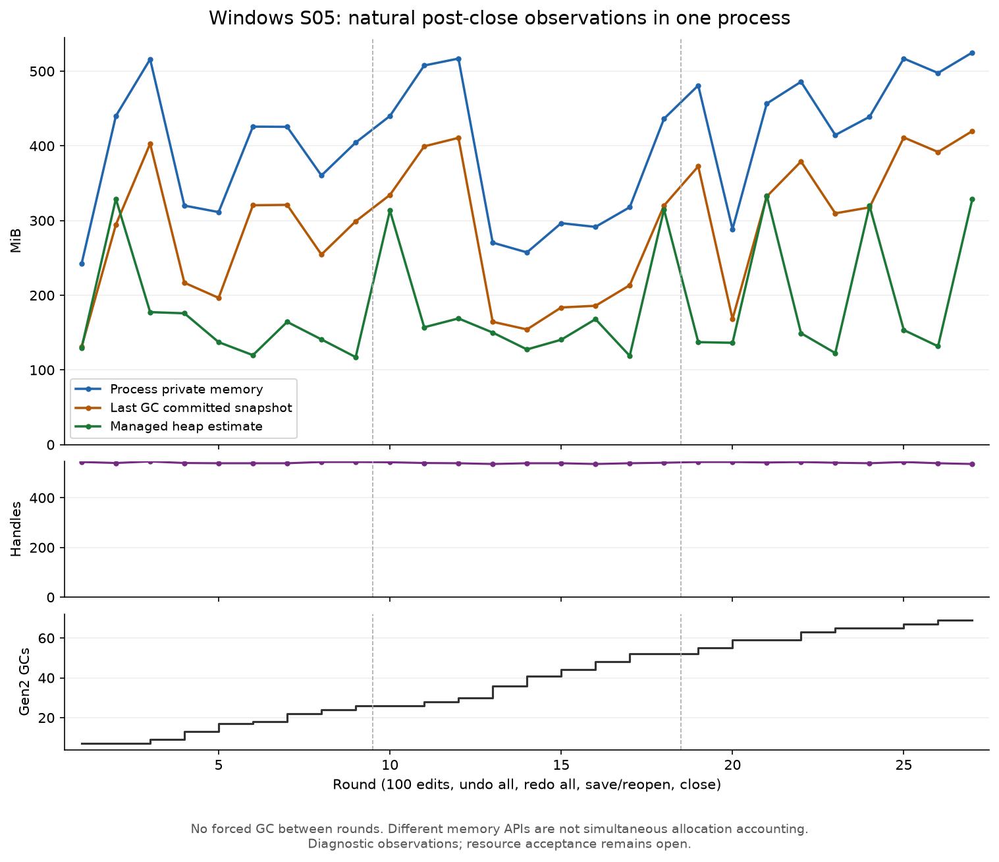

# S05 27 轮同进程诊断（2026-09-23）

**Windows 原生 27 轮和独立核心对照均已完成并复核。正确性通过，观察到多次自然回收与空间复用；资源稳定性容差尚未冻结，`resourceAccepted` 仍为 false。** 原三轮 S05 门槛未变，没有修改笔刷算法、缓存策略、GC 配置或生产框架决定。

新增 `--s05-extended-window` / `--s05-extended-check`，同进程执行 27 × 100 次编辑、每轮全部撤销/重做、保存重开和文档关闭；最后自然空闲 60 秒。所有自然样本之后才执行既有的诊断 GC，逐帧记录仍保留。复核命令为 `review-s05.py <report.json> --extended`。

## 本地验证

- macOS 完整运行退出 0，用时 269.06 秒，2,700 次编辑、2,700 次撤销、2,700 次重做、56,700 个连续回调；最终旧文档引用为零。
- 54 张 4000×4000 final/reopened 图片独立解码后的 RGBA，全部与 R9 Windows 已有固定结果一致。共同 SHA-256 为 `a8a62c6c48e71e2ce419ee56802d7160c0beaeded89c386d903ac60deba58a8e`。
- 原九轮报告不能作为 extended 结果通过。缺帧、提前强制 GC、空闲不足、旧文档残留、轮数错误五个反例均退出 1，见 [反例](negative-controls.json)。原九轮模式的新旧复核输出逐字节一致，见 [兼容核对](nine-round-review-regression.json)。
- Windows x64 和 macOS arm64 构建通过，24 项锁定依赖身份未变。首次锁定构建拒绝不同 RID；随后使用独立临时锁文件。离线源没有 win-x64 apphost 包，因此采用现有 `dotnet <dll>` 启动方式并禁用 apphost，未新增下载或变更仓库锁文件。

[包身份](preparation.json)、[逐文件清单](package-manifest.json)、[实机运行器](run-windows.py)、[独立像素/资源分析](analyze.py)均保留。包对应 `f1ac69a` 基础源码和清单记录的诊断补丁；不是宣称该 commit 已包含新模式。

## Windows 最终结果

Windows 已通过 UU 启动 PID 40896，输出 `C:\Users\Administrator\Desktop\CompositorTest\s05-extended-20260923-180340`。启动器先校验 R9 原 DLL、依赖、固定样本和 C DLL，再复制到新的独立应用目录；不覆盖已有测试包。运行结束后保存退出码、复核输出、逐文件 SHA-256 并归档。

约 617.64 秒的中途快照：15 个完整轮次、1,570 笔记录，`completed=false`。第 12 轮关闭后专用内存约 516.9 MiB，第 13、14 轮自然下降至 270.4 / 257.4 MiB，同时 Gen2 计数增加；过程中未执行诊断强制 GC。这是自然复用证据，不是完整通过记录。中途文件保存在外部原始证据目录，不能替代最终报告。

原生画布已看到持续重绘；另一旧原型窗口部分遮挡了它。UU 坐标点击返回 `noWindowsAvailable`，重建控制句柄及切换全屏后仍未恢复；菜单、终端和文件传输可用，未重启 Windows 测试。此运行不用于证明输入焦点、物理拖动、无遮挡显示时序或 S02 性能。

原始进程于 1,131.35 秒后正常完成：原生/Windows 复核/本地独立复核均退出 0，stderr 为空。归档 37,427,017 B，SHA-256 `df1e374919f9c6a808accb7c086d94d7d05da61bf41c7a3c3b45ed8dabbaa6e8`；CRC 及 114 个文件 SHA-256 全部匹配。本地复核与 Windows 复核 JSON 一致，54 张 4K 图像均与既有 R9 Windows 结果精确一致。2,700 次编辑、2,700 次撤销、2,700 次重做、56,700 个连续回调全部完成。

| 同进程轮次 | 自然关闭后专用内存范围 | 自然关闭后句柄范围 |
| --- | --- | --- |
| 1–9 | 242.29–516.06 MiB | 539–546 |
| 10–18 | 257.39–516.88 MiB | 536–543 |
| 19–27 | 288.52–525.04 MiB | 536–544 |

- 全部自然采样的专用内存最大值为 **554.74 MiB**；是采样最大值，不能冒充连续峰值或 VRAM。
- 自然回落在第 4、8、13、14、20 等轮次出现，后续轮次可重新使用释放空间。各组关闭后上限接近，但没有预先冻结的数值容差，不能据此自动将稳定性标为通过。
- 60.064 秒空闲结束，专用内存 526.88 MiB，Gen2 仍为 69，两份刚关闭文档尚未自然回收；这是未回收状态，不能直接称为永久持有。
- 最终诊断 GC 后，旧文档引用为零、托管对象约 7.61 MiB、GC committed 约 404.08 MiB、专用内存约 450.11 MiB。GC 空间保留与对象存活大小明显不同。

完整数据：[独立复核](windows-review.json)、[逐轮与像素分析](windows-analysis.json)、[归档核验](windows-archive.json)、[进程身份](windows-identity.json)。诊断源码已固定在 `687f0f7`，包构建对应相同改动。

## 核心对照与假设结论

Windows 核心对照 PID 49836 在原生测试结束后执行，213.12 秒退出 0。相同笔刷/历史代码完成 27 轮，去掉窗口、绘制、PNG 读回和逐帧报告；最终所有历史摘要正确、旧文档引用为零。自然关闭后专用内存在 164.81–268.52 MiB 内循环，最终诊断 GC 后托管对象 304,448 B（0.29 MiB），GC committed 210,796,544 B（201.03 MiB），专用内存 219.88 MiB。见 [对照报告与身份](core-control/README.md)。

1. **GC 空间保留/复用得到支持。** 原生长测可自然回落；核心对照在没有原生绘制或逐帧报告时仍保留较大的 GC committed。
2. **本固定场景没有发现旧文档永久持有或句柄阶梯式累积。** 最终弱引用为零，句柄范围稳定；这不是所有原生资源都无泄漏的证明。
3. **报告记录是测量开销，但不能单独解释现象。** 核心对照没有这些记录，仍有 GC 空间保留；两种进程还相差绘制、导出和运行节奏，不能把二者内存差额全部归因于报告。

因此，本轮保留已有分配优化，不新增强制 GC、GC 环境开关或复杂缓冲池。资源增长的判断从“九轮后仍较高，原因未明”推进到“固定长测重复复用，运行库空间保留也可在核心路径观察到”；正式容差和其他工具/设备仍需补齐。

## 判断边界

进程专用内存、`GetTotalMemory(false)` 和 `GCMemoryInfo` 不是同步的内存归属账单。不能把专用内存减去 GC committed 就标为原生泄漏，也不能把最终 GC 后的存活对象量当作关闭后的自然占用。API 含义见 Microsoft 的 [GetTotalMemory](https://learn.microsoft.com/en-us/dotnet/api/system.gc.gettotalmemory?view=net-10.0) 与 [TotalCommittedBytes](https://learn.microsoft.com/en-us/dotnet/api/system.gcmemoryinfo.totalcommittedbytes?view=net-10.0)。

没有修改稳定性容差，也没有使用更强 GC 配置来降低测量值；完整 Windows 1.0 和 M1 均未完成。下一步将本次观测用于明确关闭后允许保留的空间和波动规则，并在冻结规则后复核；同时继续所选候选路线的原生输入与设备矩阵。此处没有把一次有限长测解释为任意工作负载的资源上限。

仓库内从 Windows 复制的 JSON 仅统一 CRLF 为 LF，字段和值保持不变；原始 ZIP 及外部解压证据未改。转换前后 SHA-256 见 [换行记录](json-normalization.json)。
