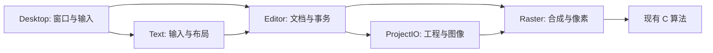

# Windows 版技术设计

状态：候选设计，尚无 Windows 实现。需求见 [PRD](product-requirements.md)；开源候选事实来源见 [调研](../research/windows-port-open-source-evaluation.md)。不把候选库的能力写成已经验证的产品能力。当前结构和修订依据见[代码耦合审计](code-coupling-audit.md)；下文是目标设计，现有 Mac 工程并不具备这些独立模块。

## 1. 实施原则

以当前 Mac 代码和可复现工程作为行为基线。先做 Windows 独立实现，保留 Mac 应用目录与 Xcode 工程；只在确有共用代码和测试后提取公共代码，不先重构整仓库。

优先保留 8 个 C 算法文件，但它们共 778 行，并非完整笔刷/编辑引擎；本机独立编译不代表 Windows ABI 已通过。界面框架只负责窗口、控件和事件接入，文档保存与最终合成不依赖窗口是否可见。先跑通一个完整编辑路径，再根据瓶颈增加依赖。

模块（Module）隐藏数据所有权、事务或资源生命周期等复杂度，通过小接口（Interface）提供可验证行为。只有实际存在多个实现时才建立替换点（Seam）与适配器（Adapter）；本计划不要求通用插件系统、全平台抽象层或同时维护两个生产 GUI。

## 2. 两个受限原型与决策方法

| 方案 | UI 与会话 | 像素与绘制 | 工具链 | 必须验证 |
| --- | --- | --- | --- | --- |
| A | Qt Widgets，C++ 文档与编辑会话 | 现有 C + QImage/QPainter 建立 CPU 基线；不足时单独评估 Skia 或 Qt GPU 路径 | CMake + 固定依赖清单 + Windows C/C++ 编译器 | 合成差异、笔刷脏区更新、中文 IME/字体加载、构建与部署成本 |
| B | Avalonia，C# 文档与编辑会话 | SkiaSharp + C 算法 DLL；明确借用/释放像素缓冲 | 固定 .NET SDK/NuGet + C DLL 的 CMake 构建 | 托管/原生传输、GC 停顿、绘制线程、文本布局与导出、依赖打包 |

两者使用同一固定图片、同一笔刷路径、同一文字样本、同一 Windows 机器。M1 只选一条生产路线：正确性、输入和运行可靠性先设通过/失败项，再比较耗时、峰值内存、构建步骤和团队维护能力。不用主观总分掩盖必需功能失败。

M1 的四条代表路径：①小型半透明图层/剪贴/调整组合的离屏与画布结果；②4K 软笔事件流→局部瓦片提交→下一笔→undo/redo→导出，记录物化与内存；③框文字在缩放/旋转/镜像下的 IME、命中与同布局栅格；④真实 Mac JSON/PNG 样本的读取→最小受支持修改→写回→Mac 核对。只实现这些路径所需功能，不铺完整产品。先判定两条方案的必要能力，后比较成本；完整版本覆盖仍在 M2–M6。

选中的方案保留，另一份原型归档为实验记录且不接入发行构建。若两者均失败，记录具体失败项后缩小问题重做验证；不会自动切换到第三套大型框架。

本项目没有 Node 前端基线，不为了统一命令而新增 package.json。未来确有 JS 工具时优先 pnpm；Qt 用 CMake，.NET 用 dotnet，遵循各自实际工具链。

## 3. 目标模块与接口约束

以下是职责设计，不是要求现在创建这些类或目录。接口名称用于说明行为，具体语言签名在 M2 随真实调用确定。

| 模块 | 接口应表达的行为 | 模块内部负责 | 不应泄漏给调用方 |
| --- | --- | --- | --- |
| Editor | 开始编辑、更新预览、提交/取消、撤销/重做、取文档快照 | 文档版本、图层树、选区、编辑事务和历史 | UI 控件指针、GPU 资源、序列化格式细节 |
| Raster | 按文档快照渲染区域、执行像素/蒙版操作、生成不可变结果 | 瓦片、像素格式、脏区、混合、缩放缓存及必要的 GPU 实现 | 每个控件自行拼接蒙版、任意可写历史像素 |
| Text | 开始/更新文本会话、命中测试、布局/栅格、确认/取消 | 字形布局、IME 组合、字体定位和缓存 | UI 与导出各自维护不同字宽/换行计算 |
| ProjectIO | 验证读取、保存快照、导入素材、导出图像 | v1–8 编解码、路径校验、文件替换、ICC/EXIF | 让 UI 自己判断哪个版本字段可以丢弃 |
| Desktop | 系统输入、对话框、窗口、剪贴板、DPI、安装/更新入口 | Qt 或 Avalonia 的具体调用与 Windows 约定 | 文档核心对 HWND、NSView、QWidget 等类型的依赖 |

后台任务初期由上述模块的实际异步调用管理，不先建立任务调度框架。需要 CPU/GPU 两种实现时才收敛稳定 Raster 接口，避免每个像素函数都配一套接口和工厂。



Text 生成的栅格和元数据作为一次编辑结果交给 Editor；ProjectIO 的导出从不可变快照经 Raster 完成，不截取 UI。

## 4. 文档模型与内存

保留现有概念：文档 ID/尺寸/分辨率、按自底向上排列的图层、parentID、transform、opacity/blendMode、raster mask、maskSourceID、adjustment、shape、text。UI 的展开状态与视口状态不混入持久化业务字段；选区属于可撤销状态，但按当前基线不持久化到工程。

像素基础约定：

- 与现有 C 接口相接的图像使用 **8-bit、预乘 RGBA、显式 stride**；蒙版为单通道 8-bit，白显黑隐。
- 实际显示库若用 BGRA，在明确的交接位置转换，并记录该转换成本；不能通过更改现有 C 算法的隐含字节序蒙混过去。
- 浮点笔刷密度属于临时计算状态，与最终 RGBA8/Gray8 分开。纹理格式与 CPU 存储是否一致由实际后端验证。
- 文档坐标统一左上原点、以像素为单位；角度方向按已有 transform 语义；文本字号/行距/字距以 point 保存，转换系数为文档 DPI/72。
- 资产身份/版本是明确契约：当前图层相等性、历史去重、文本/形状参数有效性和过期结果校验依赖 CGImage 身份；Windows 应用不可变图像句柄或局部版本标识表达这些行为，不把内容相同与同一编辑版本混淆。
- 不可变快照共享未修改瓦片。新笔划只替换脏瓦片；历史引用的像素不得被后续操作原地修改。初始瓦片大小沿用 256×256，是否调整需实测。

不承诺整个编辑核心零拷贝。要求把必要复制限制在明确位置并可测量；100 MP 输入与额外蒙版上限也不能代替 RAM/显存预算。对框架对象使用 RAII 或明确 Dispose/所有权规则；C DLL 返回内存由同一分配方释放。

现有 C 的头文件和 ABI 必须单独核查，尤其 `long`、`size_t`、`M_PI`、调用约定、符号导出和结构体对齐。C# 接入不得把 Windows 的 C `long` 想当然映射为 C# `long`。需要稳定跨语言结构时使用明确宽度类型；只修改确有问题的函数接口。当前头文件缺少 C++ linkage 包装，裸 include 到 C++ 已复现链接失败；Qt Adapter 明确 `extern "C"`，DLL 路线明确导出与分配方释放。逐函数核对布局：spot_heal/wand_mask 的 coverage 是紧密 width×height，content_fill 另有 maskStride，Levels 用 count；不可套一个 stride 假设。

## 5. 渲染与编辑语义

M0 从 `LayerRenderer`、`LiveMaskRenderer`、`LayerAppearance` 和现有测试生成渲染规则表，明确组穿透、组蒙版、剪贴链、调整层和独立蒙版变换的顺序。底层库“支持 Multiply”只证明存在算子，不证明这些组合规则等价。

目标是画布预览与导出使用同一文档合成规则；当前 Mac 的预览调度在 CanvasView.drawLayers，导出在 ImageExporter.render，仅共享部分渲染模块。Windows 应在 M2 让同一个合成实现接收已提交/预览状态；预览可改变采样分辨率，不改变图层意义。Color Dodge/Burn、Hue/Saturation/Color/Luminosity、半透明边缘和透视插值建立专项参考图。

CoreImage 迁移按操作逐项处理：

| 当前能力 | 初始实现方向 | 必须对照 |
| --- | --- | --- |
| CIColorCube、色阶/曲线/颜色矩阵 | 优先保留 LUT/现有数值算法，按需使用 C/OpenCV | 工作空间、alpha、查表插值 |
| 高斯/运动模糊 | CPU 基线及必要的 OpenCV 算子 | 扩展边界、半径单位、选区和蒙版 |
| 透视变换 | 图形库或 OpenCV 单一路径 | 坐标方向、采样和透明边缘 |
| vImage 降采样/反相 | 经校准的 CPU 实现，必要时 OpenCV/libvips | Lanczos 边界、蒙版、缓存失效 |
| 内容填充/修复/魔棒/噪声等 | 当前 8 个 C 文件 | 相同随机种子、覆盖率、内存失败和透明像素 |

依赖按实际缺口引入；如果已有绘制库满足一个操作，不再为同一操作同时引入 OpenCV 与 libvips。

M1 先验证笔刷数值与数据通路的可行性，M5 扩展规模与优化。当前 CPU fallback 用 dabs，Metal 用连续密度积分，必须明确 Windows 参考算法和对照容差，不能把 CPU/GPU 当成天然等价。CPU 不满足冻结门槛时，先验证一个 GPU 路径或登记目标调整，再通过 M1；不为不可行的底座继续铺 UI。保留永久密度/临时笔尾分离和局部瓦片提交语义。GPU 原型必须报告上传、同步、回读与展示全路径；不得只展示 kernel 耗时。Qt GPU、Skia GPU、wgpu 是候选实现，不默认要求互相共享纹理或同时存在。

## 6. 文本与字体：本轮新增的重要工作

当前 `Document/TextTool.swift` 用 TextKit 统一编辑和栅格，`Rendering/TextEditorOverlay.swift` 处理变换后的输入，`Document/FontLibrary.swift` 用 CoreText 注册字体。Windows 需要重新实现这些系统调用，但保留 `LayerTextStyle` 的内容、PostScript 名、point 单位、布局模式和 PNG 缓存语义。

候选实现：

- Qt 路线验证同一 `QTextDocument`/布局结果承担编辑、光标命中与栅格；`QTextLayout` 提供布局、光标位置及 preedit 能力，字体加载候选为 `QFontDatabase`。仍需验证 PostScript 名定位、TTC 多 face、旋转和镜像输入。[布局文档](https://doc.qt.io/qt-6/qtextlayout.html)、[字体文档](https://doc.qt.io/qt-6/qfontdatabase.html)
- Avalonia 路线验证 `TextLayout`、文本控件的编辑结果与画布绘制一致，并验证 FontManager 的自定义字体接入。文档 API 的存在不证明任意本地 TTC 导入或导出已满足，需要 M1 实验。[TextLayout](https://api-docs.avaloniaui.net/docs/T_Avalonia_Media_TextFormatting_TextLayout)、[FontManager](https://api-docs.avaloniaui.net/docs/T_Avalonia_Media_FontManager)

两条路线都不允许原生控件和图像引擎各自独立排版。M1 如果无法证明共享布局与 IME 可用，应把该方案标为未通过，而不是等完整 UI 写完再解决。

跨平台规则：打开和不改变栅格尺寸的普通移动/旋转/翻转保留保存像素；显式编辑后采用 Windows 布局，保留内容和标识并允许撤销。当前 Mac 的缩放提交会调用 redrawText，Image Size 改像素尺寸会清除 text；原先“仅变换都保留栅格”不是当前事实。D-11 在 M0 决定文本缩放/缺字体行为并同步 PRD 与样本；像素编辑和尺寸变更的栅格化按既定语义反馈并支持撤销。不同平台同字体重新排版也可能有差异，不承诺逐像素一样。字体缺失时先保留 PNG；不能无提示用系统字体覆盖它。

复用现有两份思源字体和 `Resources/Licenses` 中的许可文件，核对 [字体来源](../../Compositor/Resources/Fonts/SOURCES.md)。导入字体放用户应用数据目录，不要求写系统字体目录；默认不随工程再分发。当前 100 MiB 限制与文件校验迁移时保持，若改限制必须同步 PRD 和测试。

## 7. 工程格式与安全保存

格式权威来源是当前 `ProjectStore.swift`、[格式说明](../project-format.md)和实际编码样本。Swift Codable 的枚举/几何编码必须用真实 JSON 样本确认，不能凭字段名手写一个看似合理但不兼容的 schema。

Windows reader 在建立活跃文档前完成版本、字段、路径、层级、资源完整性及像素上限校验。持久化 v1–8，新写 v8；已知版本中的新增可选字段规则随真实样本记录。未来主版本拒绝；不能在读取失败后自动降级扁平图片并覆盖保存。

Alpha 仅支持子集时，对包含未实现语义的工程阻止编辑保存。Beta 全量解析包含 text、shape、adjustment、maskPlacement、maskLinked 等当前字段；不因 UI 尚未实现就删字段。

第一版目录结构建议：

```text
Example.comp/
  manifest.json
  images/
    <UUID>.png
    <UUID>.mask.png
```

字段、默认值、限制、版本引入点及实际编码形态在 M0 生成兼容清单；当前基线包括单边 30,000、10,000 图层、4 MiB manifest、512 MiB 单资产、100 MP 源图与独立蒙版像素预算。导出还检查画布总像素。资源失败时保持原活动文档。

保存实现采用同卷相邻临时目录写完整快照并验证后替换。对已存在的目录，Windows 的目录替换不能假设等同 POSIX 原子 rename：保留旧副本并定义交换中断的恢复步骤，成功确认后再清理备份；失败路径不递归删除来源不明的目录。优先实现有限状态的恢复逻辑，不引入通用日志数据库。

首版沿用 Mac 策略，保存期间阻止重叠编辑，成功后标记保存点；先验证失败解除 busy、取消与历史一致性。若后续允许后台保存时继续编辑，则必须只将已保存快照 revision 记为保存点，当前新状态仍为未保存；这是新增并发行为，不能直接照搬当前 markSaved()。导出从同样的不可变快照进行，但不更新保存点。

如未来决定使用 ZIP 单文件，另写容器规范、资源解包上限、路径校验及 Mac 兼容 reader；不能仅换扩展名，也不在本轮自动升 v9。

## 8. 任务、线程与错误

UI 线程处理交互和提交事务；解码、导出、昂贵滤镜、AI 推理进入可取消后台工作。后台结果携带文档 ID 和输入 revision；文档已关闭、切换或被新预览替代时丢弃过期结果，不能写回另一个项目。

预览与正式提交分开；取消不写历史。记录一次操作所需的前后状态，避免拖动每个事件变成一个撤销项。中间像素和缓存不能无限增长；是否需要专用线程池由实际负载决定。

错误至少区分不支持版本/能力、输入损坏/超限、缺少字体/模型、内存不足、读写失败和操作取消。业务接口返回可恢复结果，不让底层异常直接终止应用。诊断日志不包含图片内容、完整文字内容或不必要的用户路径。

## 9. AI、编解码与发行依赖

AI 采用 ONNX Runtime CPU 基线；M1 对候选权重、实际模型推理路径和获取/分发方式做可行性筛查，M6 再用固定样本比较 BiRefNet/U²-Net 等候选并锁定。运行时 MIT 不覆盖全部模型权重许可；记录来源、hash、版本、输入归一化、输出蒙版语义和所需算子。GPU EP 根据设备/模型选择，保留 CPU 路径，不要求 NVIDIA 专用硬件。

DirectML 文档中的算子限制和持续维护状态、BiRefNet 某些导出方式的限制见 [调研](../research/windows-port-open-source-evaluation.md)。首个 GPU 测试必须针对所选模型，不能只跑一个无关 demo 判定兼容。

图像 IO 先使用框架已有能力，再按缺口加入 libjpeg-turbo/libpng/libtiff/libheif；ICC 采用已验证的框架颜色转换或 Little CMS，统一输入归一化和导出 profile。M1 先筛查 HEIC 的解码与分发路径，M6 用最终包完成验证。实际发行清单必须按构建产物核对，避免只检查顶层库许可证。

Qt/C++ 路线先评估 WinSparkle + 安装器；.NET 路线先评估 Velopack。只保留一种更新通路。内部 CI 先产便携包和候选安装包，再验证签名、更新和卸载；不把生成 exe 当作发行完成。

## 10. 仓库和构建布局建议

M1 前仅增加 `experiments/windows/` 下的受限原型及测试资源。M1 选型后建议增加 `windows/` 作为生产入口，并使用其实际工具链文件；功能源码不混入 Xcode 自动扫描目录。

在初始 Windows 构建中，可直接引用现有 `Compositor/Rendering/*.c` 编译。若适配需修改这些文件，Windows 与 Mac 都跑对应测试；只有确实需要双方共用的目录结构时才迁移到公共目录。字体同理，避免复制后版本分叉。

CI 初期只加必要路径：Windows Release 构建、核心/格式/渲染测试、候选包产物；对公共 C、字体、格式样本的修改补 Mac 对应检查。GUI 和硬件性能测试独立于无 GPU 的 CI runner，记录实机结果。依赖版本固定，能由干净环境重建；版本号在 M1 后据真实可用版本锁定。

## 11. 决策记录

| ID | 问题 | 当前建议/状态 | 最晚阶段 | 决策所需证据 |
| --- | --- | --- | --- | --- |
| D-01 | OS/CPU 范围 | 建议 Windows 11 x64；待确认 | M0 | 目标用户设备、可用实机、依赖支持 |
| D-02 | GUI/语言 | Qt/C++ 或 Avalonia/C#，未决定 | M1 | 同场景原型、文本输入验证、团队维护能力 |
| D-03 | 笔刷算法/GPU 方案 | CPU 先测；确认与 Metal 基线的语义差异；无默认独立 GPU 库 | M1 可行性，M5 优化定稿 | 连续覆盖、历史/物化、端到端耗时；CPU 不达标时先证明备选路径 |
| D-04 | 工程容器 | 建议首版继续 v8 目录包 | M0 | Windows 打开/复制体验、Mac 互读；单文件需求是否必需 |
| D-05 | 文字排版 | 保存栅格保真，编辑后平台重排 | M1 | 同字体/缺失字体、IME、光标与栅格一致性 |
| D-06 | 性能及硬件 | 拟定门槛见验证文档，未实测 | M1 | 固定参考机、完整测试记录 |
| D-07 | 发行许可证/依赖 | 保留现有项目 MIT，第三方逐项列明；是否接受特定依赖义务待确认 | M1 | 所选版本/模块、链接方式、发行策略 |
| D-08 | AI 模型/后端 | CPU 基线；权重未选 | M6 | 效果、延迟、包体/内存、权重许可与 GPU 算子覆盖 |
| D-09 | 安装和更新 | WinSparkle 组合或 Velopack 二选一 | M6 | 所选框架、签名/更新渠道、干净系统试验 |
| D-10 | Mac 后续同步 | 固定基线，阶段性合入已审查变更 | 持续 | 基线差异表、格式和公共代码回归；禁止无审查追随主线 |
| D-11 | 文本缩放与栅格化 | Mac 缩放重绘；原规划保留栅格存在差异，未决定 | M0 | 同字体/缺字体缩放、Image Size、撤销与保存后的实际行为；区分兼容与产品改进 |

决定后在对应行记录状态、依据、日期和关联提交。未决项限制其依赖任务，不应阻止样本准备与可逆原型。
