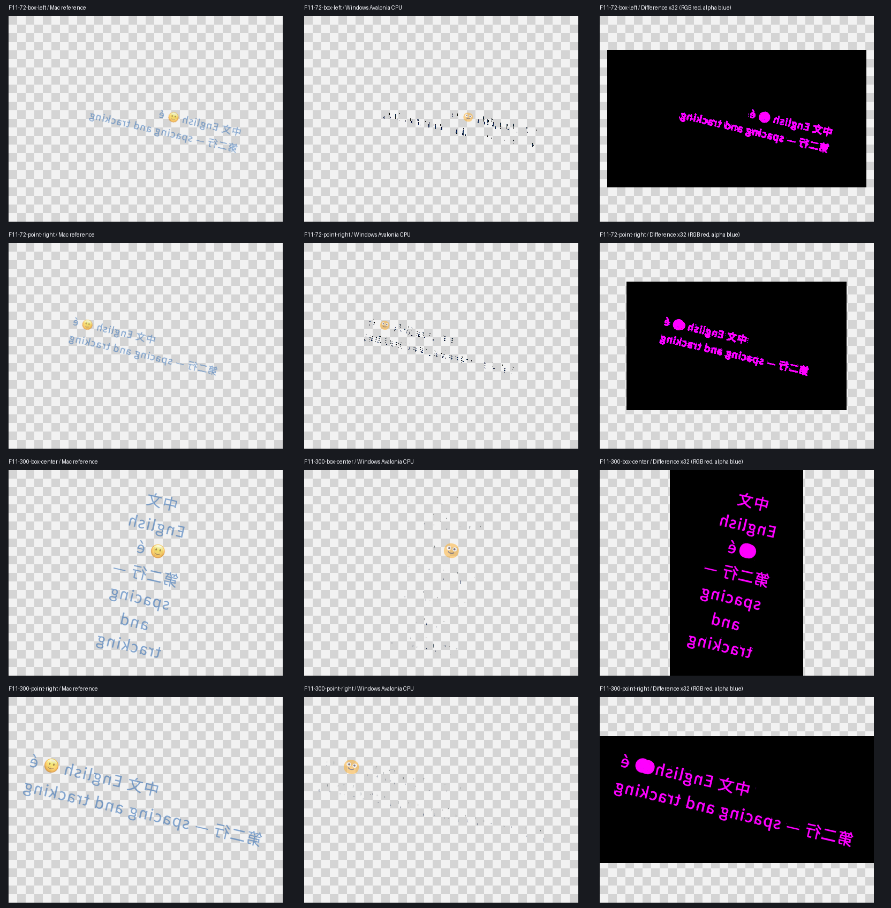
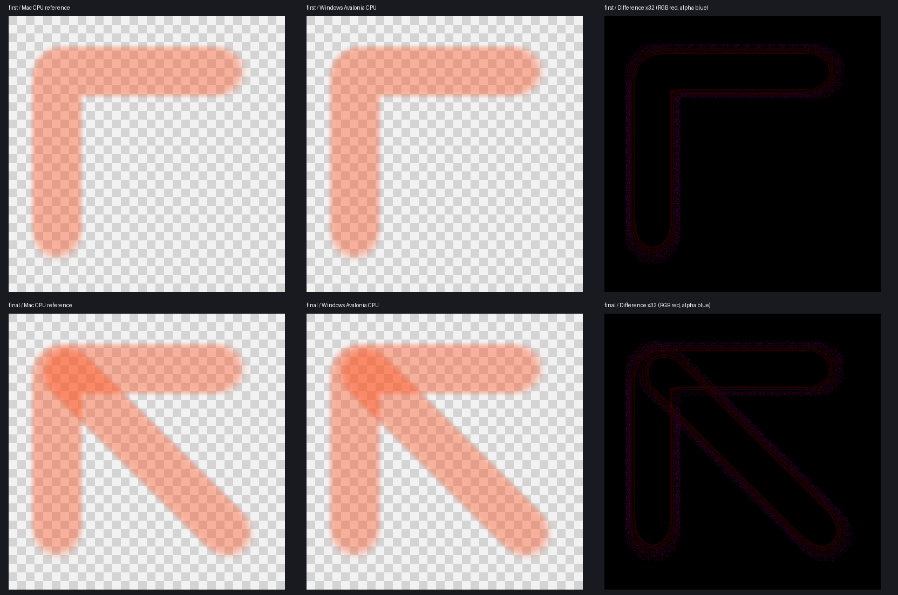

# Windows 11 实机结果复核（2026-09-21）

已收到并核验用户上传的 `Windows11-TestResults-20260921-133437.zip`。工程互通检查通过；文字画面存在明显缺失，不能验收通过。原始自动检查的“通过”结论仅适用于各自断言范围。

2026-09-21 后续诊断：同一 Windows 机器的实时变体确认，显式灰度抗锯齿恢复普通字形，默认模式仍只剩碎点。文字画布已作最小设置修复并通过 Mac 回归。用户随后回传完整修复包，12 个样本的普通字形均恢复，预览/导出与取消恢复各 12/12 精确一致；独立墨量及参考差分复算全部吻合。见 [Windows 修复复测](evidence/text-grayscale-windows11/README.md)。真实 IME 尚未执行，跨平台像素差异尚未验收。下文保留原始失败批次的结果。

## 核验范围与来源

压缩包 7,291,136 bytes、247 个文件，CRC 检查通过；SHA-256 为 `b059e2b04fd7cfbd0f516468ca78d850608db83d6c65207a7252ed4b59f2e4c4`。Windows ZIP 的反斜杠目录分隔符在解压时规范化，原压缩包未修改。文件清单、原始 JSON、独立像素核算和 Mac 测试日志保存在 [证据目录](evidence/windows11-artifact-review/review-summary.json)。Windows 程序由用户执行；本轮在 Mac 上检查其输出，没有声称重新执行 Windows 二进制。

原生 DLL 的实际 SHA-256 与先前报告一致，PE 导出表独立检查为 19 个入口；compiler.txt 确认 clang 23.1.1 / x86_64-w64-windows-gnu。C++/ctypes 原始结果与回传一致。压缩包未含独立 C# P/Invoke 原始结果文件，该项仍以先前用户贴出的结果为证据。

## 结果

| 项目 | 复核结果 | 仍需解决 |
| --- | --- | --- |
| 20 组合成 | 20/20 预览与导出一致；Mac 实际 reader/exporter 读回全部工程，manifest、图像/蒙版和 Mac 渲染结果保持一致 | 对 Mac 参考仅 F01、F02、B08 完全一致；其余 17 组有差异，最大通道误差 2/255，未接受容差 |
| 4K 两笔软笔 | 13 项会话检查通过；Windows 两张 PNG 与 Mac Avalonia 原型逐像素一致；Mac 打开 brush.comp、再保存/重开后像素一致 | 对 Mac 产品 CPU 参考最大差异 3/4，Metal 参考最大 7；更新加预览 P95 27.5388/29.166 ms，尚非正式 S02 场景 |
| 12 组文字 | 12/12 预览与导出相同、取消输入像素恢复一致；模拟输入检查通过 | **画面不通过：中英文字符大量缺失或成为碎点，emoji 仍可见**；真实 IME 未执行 |

本轮独立解码 PNG，以最近整数进行 alpha 预乘后比较 RGBA8：20 组合成、12 组文字和 4 组笔刷 CPU/Metal 参考的全部 36 组差分指标均与原报告一致。32 组预览/导出及 12 组文字取消恢复还检查了完整解码 RGBA 的精确相等。

Mac 原有两个读回测试实际执行，**2 passed / 0 skipped**。合成测试比较 Mac 对原始与 Windows 重命名工程的渲染，不意味着 Windows 渲染已与 Mac 参考完全相同。文字探针没有工程保存/读回路径。

## 文字缺失与测试漏检

四个代表样本可见中英文笔画严重缺失；12 个输出的非透明像素数仅为 577–5,091，而对应 Mac 参考为 3,920–38,535。差分最大通道误差均为 255。这已超出普通抗锯齿或字体度量差异的范围，不能只解释成 emoji 外观不同。

报告显示嵌入 Source Han Sans SC 的 hash 通过，解析字体为 Source Han Sans SC 与 Segoe UI Emoji。这只能证明资源和字体解析，不证明最终字形光栅化正确。根因尚未确定，不据此归咎于用户配置、驱动或字体回退。

`TextProbe.cs` 的非空断言只要求任意像素字节非零；同时预览和导出共用布局/渲染路径，因此相同的缺字结果也会通过。下一轮应先定位普通字形在 Windows 的绘制问题，补充独立字形覆盖/参考验证，再交付修复后的文字探针复测。保留这些失败输出，不放宽容差或把非空断言继续当作画面正确的依据。

## 笔刷时序观察

| 软件阶段 P95 | 第一笔 | 第二笔 |
| --- | ---: | ---: |
| 更新 | 24.6551 ms | 24.0563 ms |
| CPU 预览 | 3.6963 ms | 5.2598 ms |
| 更新加预览 | 27.5388 ms | 29.1660 ms |

主要耗时落在更新阶段；各阶段 P95 不能直接相加。两次提交为 25.5688/24.0438 ms。更新/预览期间采样 working set 高水位 213,577,728 bytes，不是进程峰值专用内存或 VRAM。两笔 40% 不透明度、headless CPU 的测试不满足正式 S02 的 100% 不透明度、空层/已有层和至少 30 笔要求。4090D 未用于此探针的 GPU 展示验收。

## 当前结论

本轮完成原始结果复核和 21 个工程的 Mac 读回。文字视觉正确性、笔刷性能、参考容差、真实窗口/IME/DPI/GPU 以及 Qt 同机对照仍未完成；W-008/M1 不放行。此次仅保存证据、纠正验收状态，没有改动产品、算法、测试断言或依赖，也没有公开推送。
